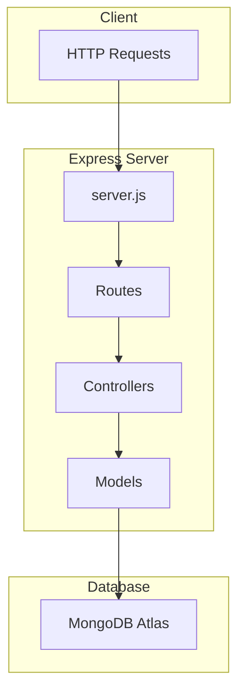
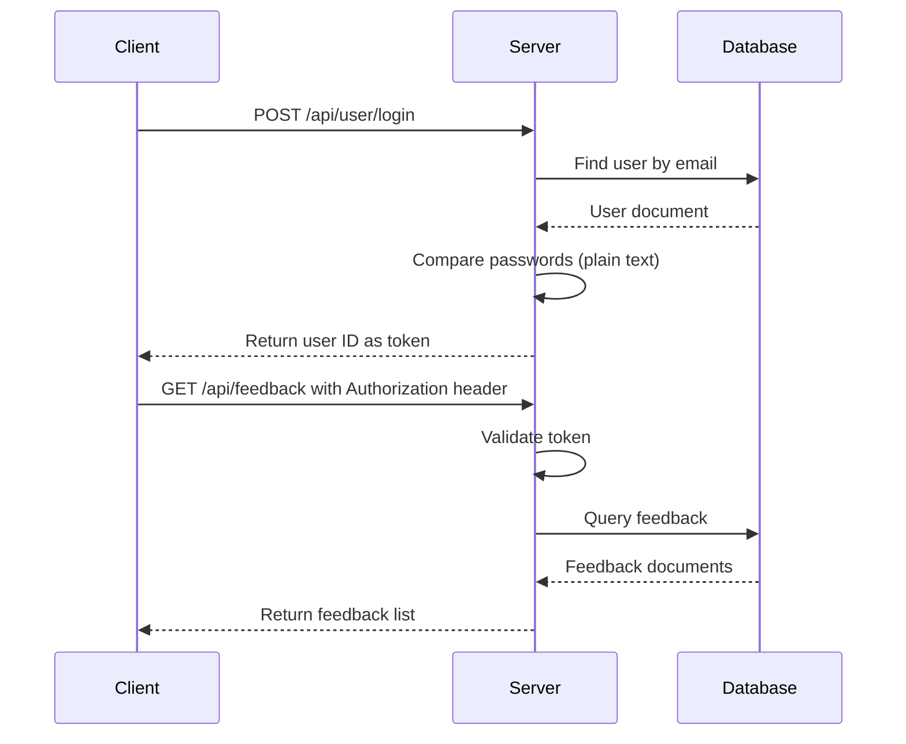

# V1 Development Plan: "Boringly Correct"

> The goal of V1 is not cleverness. It's correctness and clarity. Code should feel almost textbook.

## Overview

V1 establishes the foundation of the Feedback System API with clean, readable, and educational code. This version prioritizes clarity over optimization, following MVC architecture patterns with Mongoose ODM.

## Core Principles for V1

1. **Simplicity First** - No premature optimization
2. **Textbook Code** - Code should be self-explanatory
3. **Proper Separation** - Clean MVC boundaries
4. **Working Software** - All endpoints functional
5. **Basic Auth** - Simple authentication mechanism

---

## Architecture Overview



---

## Data Models

### User Model

```javascript
// models/User.js
{
  _id: ObjectId,
  email: String,        // required, unique
  password: String,     // required (plain text for V1)
  role: String,         // 'admin' or 'user', default: 'user'
  isVerified: Boolean,  // default: false
  createdAt: Date,
  updatedAt: Date
}
```

### Feedback Model

```javascript
// models/Feedback.js
{
  _id: ObjectId,
  userId: ObjectId,     // reference to User, required
  message: String,      // required
  category: String,     // optional
  status: String,       // 'pending', 'reviewed', 'archived'
  createdAt: Date,
  updatedAt: Date
}
```

---

## API Endpoints

### Feedback Endpoints

| Method | Endpoint            | Description         | Auth Required |
| ------ | ------------------- | ------------------- | ------------- |
| GET    | `/api/feedback`     | List all feedback   | Admin only    |
| POST   | `/api/feedback`     | Submit new feedback | User or Admin |
| GET    | `/api/feedback/:id` | Get single feedback | Admin only    |
| DELETE | `/api/feedback/:id` | Delete feedback     | Admin only    |

### User Endpoints

| Method | Endpoint          | Description     | Auth Required |
| ------ | ----------------- | --------------- | ------------- |
| GET    | `/api/user`       | List all users  | Admin only    |
| POST   | `/api/user`       | Create new user | Admin only    |
| POST   | `/api/user/login` | User login      | None          |
| GET    | `/api/user/:id`   | Get single user | Admin only    |
| PATCH  | `/api/user/:id`   | Update user     | Admin only    |
| DELETE | `/api/user/:id`   | Delete user     | Admin only    |

---

## File Structure

```
feedback-system/
├── server.js                 # Entry point, Express app setup
├── config/
│   └── db.js                 # MongoDB connection configuration
├── models/
│   ├── Feedback.js           # Feedback schema and model
│   └── User.js               # User schema and model
├── routes/
│   ├── feedback.js           # Feedback route definitions
│   └── user.js               # User route definitions
├── controllers/
│   ├── feedbackController.js # Feedback business logic
│   └── userController.js     # User business logic
├── middleware/
│   └── auth.js               # Simple authentication middleware
├── utils/
│   └── helpers.js            # Utility functions
├── .env                      # Environment variables (not in git)
├── .gitignore
├── package.json
└── README.md
```

---

## Implementation Steps

### Phase 1: Foundation Setup

1. **Environment Configuration**
   - Create `.env` file for sensitive configuration
   - Add `dotenv` package for environment variable management
   - Configure PORT and MONGODB_URI

2. **Database Connection**
   - Implement [`config/db.js`](config/db.js) with Mongoose connection
   - Add connection event listeners for logging
   - Handle connection errors gracefully

3. **Server Setup**
   - Implement [`server.js`](server.js) with Express app
   - Configure JSON body parser
   - Set up basic error handling

### Phase 2: Models Implementation

4. **User Model**
   - Create [`models/User.js`](models/User.js)
   - Define schema with validation
   - Add timestamps via schema options

5. **Feedback Model**
   - Create [`models/Feedback.js`](models/Feedback.js)
   - Define schema with User reference
   - Add timestamps via schema options

### Phase 3: Authentication

6. **Simple Auth Middleware**
   - Create [`middleware/auth.js`](middleware/auth.js)
   - Implement basic auth header parsing
   - Create `requireAuth` and `requireAdmin` middleware functions

### Phase 4: Controllers Implementation

7. **User Controller**
   - Create [`controllers/userController.js`](controllers/userController.js)
   - Implement CRUD operations
   - Implement login functionality

8. **Feedback Controller**
   - Create [`controllers/feedbackController.js`](controllers/feedbackController.js)
   - Implement CRUD operations
   - Add user association logic

### Phase 5: Routes Implementation

9. **User Routes**
   - Create [`routes/user.js`](routes/user.js)
   - Map endpoints to controller functions
   - Apply authentication middleware

10. **Feedback Routes**
    - Create [`routes/feedback.js`](routes/feedback.js)
    - Map endpoints to controller functions
    - Apply authentication middleware

### Phase 6: Integration and Testing

11. **Route Integration**
    - Mount routes in [`server.js`](server.js)
    - Add 404 handler for unknown routes
    - Add global error handler

12. **Manual Testing**
    - Test all endpoints with different user roles
    - Verify authentication flow
    - Test error scenarios

---

## Authentication Strategy for V1

V1 uses a **simple token-based authentication** approach:

1. User logs in with email/password
2. Server returns a simple token (could be user ID or random string)
3. Client includes token in `Authorization` header
4. Middleware validates token and attaches user to request

> Note: This is intentionally naive. V2 will implement JWT and bcrypt.

### V1 Auth Flow



---

## Dependencies

Current dependencies (already installed):

- `express` - Web framework
- `mongoose` - MongoDB ODM

Additional dependencies needed:

- `dotenv` - Environment variable management

---

## Success Criteria for V1

- [ ] Server starts without errors
- [ ] Database connects successfully
- [ ] All user endpoints work correctly
- [ ] All feedback endpoints work correctly
- [ ] Authentication middleware blocks unauthorized access
- [ ] Admin-only routes are protected
- [ ] Code is readable and well-organized
- [ ] No external dependencies beyond Express and Mongoose (plus dotenv)

---

## What V1 Deliberately Excludes

The following are deferred to V2:

- JWT authentication
- Password hashing (bcrypt)
- Input validation libraries
- Comprehensive error handling middleware
- Rate limiting
- Logging (Winston)
- Testing (Jest)
- TypeScript

---

## Next Steps

After V1 is complete:

After V1 is complete:

1. Document architectural decisions in README
2. Identify pain points and areas for improvement
3. Plan V2 features based on V1 experience
