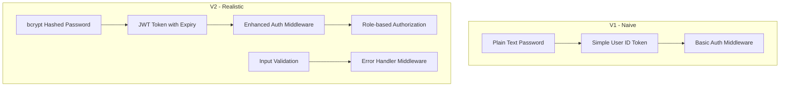

# V2 Development Plan: "About Realism"

## Overview

V2 transforms the project from a tutorial-like implementation to something production-like. The focus is on security, validation, and proper error handling.

## Goals

- Replace naive authentication with JWT
- Secure password storage with bcrypt
- Add proper input validation
- Implement centralized error handling
- Enhance role-based authorization

---

## Architecture Changes



---

## Implementation Tasks

### 1. Install New Dependencies

```bash
npm install bcryptjs jsonwebtoken express-validator express-rate-limit
```

| Package              | Purpose                           |
| -------------------- | --------------------------------- |
| `bcryptjs`           | Password hashing with salt rounds |
| `jsonwebtoken`       | JWT generation and verification   |
| `express-validator`  | Request input validation          |
| `express-rate-limit` | API rate limiting protection      |

---

### 2. Environment Configuration

Update `.env` with JWT settings:

```env
# JWT Configuration
JWT_SECRET=your_super_secret_jwt_key
JWT_EXPIRES_IN=7d
```

---

### 3. Password Hashing

**File:** `utils/passwordHash.js` (new)

**Functions:**

- `hashPassword(password)` - Hash password with bcrypt
- `comparePassword(password, hash)` - Compare plain text with hash

**Integration Points:**

- [`controllers/userController.js`](../controllers/userController.js) - `createUser`, `loginUser`, `updateUser`

---

### 4. JWT Authentication

**File:** `utils/jwt.js` (new)

**Functions:**

- `generateToken(user)` - Create JWT with user payload
- `verifyToken(token)` - Verify and decode JWT

**Token Payload:**

```json
{
  "id": "user_id",
  "email": "user@email.com",
  "role": "admin|user"
}
```

---

### 5. Enhanced Auth Middleware

**File:** `middleware/auth.js` (update)

**Changes:**

- Replace simple user ID token with JWT verification
- Add token expiry handling
- Add proper error messages for invalid/expired tokens

**New Middleware:**

- `requireAuth` - Verify JWT and attach user to request
- `requireAdmin` - Check admin role (unchanged)
- `requireOwnershipOrAdmin` - Allow user to access own resources OR admin

---

### 6. Input Validation

**File:** `middleware/validators.js` (new)

**Validation Schemas:**

| Endpoint                  | Validations                                  |
| ------------------------- | -------------------------------------------- |
| `POST /api/user`          | email format, password min length, role enum |
| `POST /api/user/login`    | email format, password required              |
| `PATCH /api/user/:id`     | optional fields validation                   |
| `POST /api/feedback`      | message min length, category optional        |
| `PATCH /api/feedback/:id` | status enum validation                       |

---

### 7. Error Handling Middleware

**File:** `middleware/errorHandler.js` (new)

**Features:**

- Centralized error handling
- Custom error classes (AppError, ValidationError, AuthError)
- Consistent error response format
- Development vs production error details

**Error Response Format:**

```json
{
  "error": "Error Type",
  "message": "Human readable message",
  "details": {} // Optional, validation errors
}
```

---

### 8. Rate Limiting

**File:** `middleware/rateLimiter.js` (new)

**Configurations:**

- General API: 100 requests per 15 minutes
- Login endpoint: 5 requests per 15 minutes (brute force protection)
- Create feedback: 10 requests per minute

---

## File Structure After V2

```
feedback-system/
├── config/
│   └── db.js
├── controllers/
│   ├── feedbackController.js
│   └── userController.js
├── middleware/
│   ├── auth.js          (updated)
│   ├── errorHandler.js  (new)
│   ├── rateLimiter.js   (new)
│   └── validators.js    (new)
├── models/
│   ├── Feedback.js
│   └── User.js
├── routes/
│   ├── feedback.js
│   └── user.js
├── utils/
│   ├── helpers.js
│   ├── jwt.js           (new)
│   └── passwordHash.js  (new)
├── .env
├── .env.example
├── package.json
└── server.js            (updated - add error handler)
```

---

## Migration Strategy

### User Password Migration

Existing users in database have plain text passwords. Options:

1. **Force password reset** - Users must reset on first V2 login
2. **Migration script** - Hash all existing passwords
3. **Lazy migration** - Hash on next successful login

**Recommended:** Option 3 (Lazy migration) - Check if password is bcrypt hash, if not, hash it after successful login.

---

## Testing Checklist

- [ ] Password hashing works correctly
- [ ] JWT generation and verification
- [ ] Login returns JWT token
- [ ] Protected routes require valid JWT
- [ ] Expired tokens are rejected
- [ ] Input validation catches invalid data
- [ ] Rate limiting prevents brute force
- [ ] Error responses are consistent
- [ ] Existing users can still login (lazy migration)

---

## Commit Strategy

Each major component gets its own commit:

1. `feat: add password hashing utility with bcrypt`
2. `feat: add JWT utility for token generation and verification`
3. `feat: update auth middleware to use JWT`
4. `feat: add input validation middleware with express-validator`
5. `feat: add centralized error handling middleware`
6. `feat: add rate limiting for API protection`
7. `refactor: update user controller with password hashing`
8. `refactor: update user controller with JWT login`
9. `test: verify all V2 features working`

---

## Questions to Resolve

1. **JWT expiry time:** 7 days? 1 day? Configurable per environment?
2. **Rate limit values:** Are the proposed limits appropriate?
3. **Password requirements:** Minimum length? Complexity rules?
4. **Token refresh:** Should we implement refresh tokens in V2 or V3?

## Next Steps

1. Review and approve this plan
2. Install dependencies
3. Implement each component in order
4. Test after each commit
5. Update documentation
