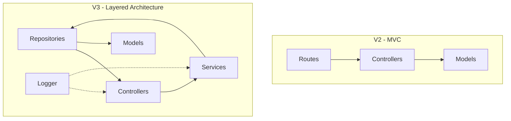

# V3 Development Plan: "Architectural Evolution"

## Overview

V3 transforms the project from a realistic implementation to an architecturally sophisticated one. The focus is on separation of concerns, testability, and enterprise patterns.

## Goals

- Extract business logic into service layer
- Implement repository pattern for data access
- Refactor to feature-based structure
- Add comprehensive logging
- Add automated testing

---

## Architecture Evolution



---

## Implementation Tasks

### 1. Install New Dependencies

```bash
npm install winston
npm install --save-dev jest supertest @types/jest
```

| Package     | Purpose                  |
| ----------- | ------------------------ |
| `winston`   | Production-grade logging |
| `jest`      | Testing framework        |
| `supertest` | HTTP assertion testing   |

---

### 2. Feature-Based Structure

**Current (V2) - MVC Folders:**

```
controllers/
  ├── userController.js
  └── feedbackController.js
models/
  ├── User.js
  └── Feedback.js
routes/
  ├── user.js
  └── feedback.js
```

**New (V3) - Feature-Based:**

```
features/
  ├── user/
  │   ├── userController.js
  │   ├── userService.js
  │   ├── userRepository.js
  │   ├── userModel.js
  │   ├── userRoutes.js
  │   └── __tests__/
  │       ├── userController.test.js
  │       └── userService.test.js
  └── feedback/
      ├── feedbackController.js
      ├── feedbackService.js
      ├── feedbackRepository.js
      ├── feedbackModel.js
      ├── feedbackRoutes.js
      └── __tests__/
          ├── feedbackController.test.js
          └── feedbackService.test.js
```

---

### 3. Service Layer

**Purpose:** Business logic lives here, not in controllers.

**Example - `userService.js`:**

```javascript
class UserService {
  constructor(userRepository, passwordHasher, tokenGenerator) {
    this.userRepository = userRepository;
    this.passwordHasher = passwordHasher;
    this.tokenGenerator = tokenGenerator;
  }

  async register(email, password, role) {
    // Business logic: check if user exists
    const existing = await this.userRepository.findByEmail(email);
    if (existing) throw new ConflictError("User already exists");

    // Business logic: hash password
    const hashedPassword = await this.passwordHasher.hash(password);

    // Business logic: create user
    return this.userRepository.create({
      email,
      password: hashedPassword,
      role: role || "user",
    });
  }

  async login(email, password) {
    const user = await this.userRepository.findByEmail(email);
    if (!user) throw new AuthError("Invalid credentials");

    const isValid = await this.passwordHasher.compare(password, user.password);
    if (!isValid) throw new AuthError("Invalid credentials");

    return {
      user: this.sanitizeUser(user),
      token: this.tokenGenerator.generate(user),
    };
  }

  sanitizeUser(user) {
    const { password, ...safe } = user.toObject();
    return safe;
  }
}
```

---

### 4. Repository Pattern

**Purpose:** Abstract database operations for testability and flexibility.

**Example - `userRepository.js`:**

```javascript
class UserRepository {
  constructor(model) {
    this.model = model;
  }

  async findById(id) {
    return this.model.findById(id).select("-password");
  }

  async findByEmail(email) {
    return this.model.findOne({ email });
  }

  async findAll() {
    return this.model.find().select("-password");
  }

  async create(data) {
    return this.model.create(data);
  }

  async update(id, data) {
    return this.model.findByIdAndUpdate(id, data, { new: true });
  }

  async delete(id) {
    return this.model.findByIdAndDelete(id);
  }
}
```

**Benefits:**

- Easy to mock in tests
- Can swap Mongoose for another ORM without changing services
- Single responsibility for data access

---

### 5. Logging with Winston

**File:** `utils/logger.js`

```javascript
import winston from "winston";

const logger = winston.createLogger({
  level: process.env.LOG_LEVEL || "info",
  format: winston.format.combine(
    winston.format.timestamp(),
    winston.format.errors({ stack: true }),
    winston.format.json(),
  ),
  transports: [
    new winston.transports.Console({
      format: winston.format.combine(
        winston.format.colorize(),
        winston.format.simple(),
      ),
    }),
    new winston.transports.File({ filename: "logs/error.log", level: "error" }),
    new winston.transports.File({ filename: "logs/combined.log" }),
  ],
});

export default logger;
```

**Usage in Services:**

```javascript
logger.info("User registered", { email, userId: user._id });
logger.error("Login failed", { email, reason: "invalid_password" });
```

---

### 6. Testing with Jest + Supertest

**Example - `userService.test.js`:**

```javascript
import UserService from "../userService";
import {
  mockUserRepository,
  mockPasswordHasher,
  mockTokenGenerator,
} from "./mocks";

describe("UserService", () => {
  let userService;

  beforeEach(() => {
    userService = new UserService(
      mockUserRepository,
      mockPasswordHasher,
      mockTokenGenerator,
    );
  });

  describe("register", () => {
    it("should create a new user with hashed password", async () => {
      mockUserRepository.findByEmail.mockResolvedValue(null);
      mockPasswordHasher.hash.mockResolvedValue("hashed_password");
      mockUserRepository.create.mockResolvedValue({
        _id: "123",
        email: "test@test.com",
      });

      const result = await userService.register(
        "test@test.com",
        "password123",
        "user",
      );

      expect(mockPasswordHasher.hash).toHaveBeenCalledWith("password123");
      expect(mockUserRepository.create).toHaveBeenCalled();
      expect(result.email).toBe("test@test.com");
    });

    it("should throw ConflictError if user exists", async () => {
      mockUserRepository.findByEmail.mockResolvedValue({
        email: "test@test.com",
      });

      await expect(
        userService.register("test@test.com", "password123", "user"),
      ).rejects.toThrow("User already exists");
    });
  });
});
```

**Example - `userController.test.js` (Integration):**

```javascript
import request from "supertest";
import app from "../../../server";

describe("User Endpoints", () => {
  describe("POST /api/user/login", () => {
    it("should return JWT token for valid credentials", async () => {
      const response = await request(app)
        .post("/api/user/login")
        .send({ email: "admin@test.com", password: "admin123" });

      expect(response.status).toBe(200);
      expect(response.body.token).toBeDefined();
    });

    it("should return 401 for invalid credentials", async () => {
      const response = await request(app)
        .post("/api/user/login")
        .send({ email: "admin@test.com", password: "wrong" });

      expect(response.status).toBe(401);
    });
  });
});
```

---

### 7. Dependency Injection (Optional)

For better testability, consider a simple DI container:

**File:** `config/container.js`

```javascript
import UserRepository from "../features/user/userRepository";
import FeedbackRepository from "../features/feedback/feedbackRepository";
import UserService from "../features/user/userService";
import FeedbackService from "../features/feedback/feedbackService";
import User from "../features/user/userModel";
import Feedback from "../features/feedback/feedbackModel";
import { hashPassword, comparePassword } from "../utils/passwordHash";
import { generateToken } from "../utils/jwt";

const container = {
  userRepository: new UserRepository(User),
  feedbackRepository: new FeedbackRepository(Feedback),

  get userService() {
    return new UserService(
      this.userRepository,
      { hash: hashPassword, compare: comparePassword },
      { generate: generateToken },
    );
  },

  get feedbackService() {
    return new FeedbackService(this.feedbackRepository);
  },
};

export default container;
```

---

## File Structure After V3

```
feedback-system/
├── config/
│   ├── container.js      (new - DI container)
│   └── db.js
├── features/
│   ├── user/
│   │   ├── __tests__/
│   │   │   ├── userController.test.js
│   │   │   └── userService.test.js
│   │   ├── userController.js
│   │   ├── userModel.js
│   │   ├── userRepository.js
│   │   ├── userRoutes.js
│   │   └── userService.js
│   └── feedback/
│       ├── __tests__/
│       │   ├── feedbackController.test.js
│       │   └── feedbackService.test.js
│       ├── feedbackController.js
│       ├── feedbackModel.js
│       ├── feedbackRepository.js
│       ├── feedbackRoutes.js
│       └── feedbackService.js
├── middleware/
│   ├── auth.js
│   ├── errorHandler.js
│   ├── rateLimiter.js
│   └── validators.js
├── utils/
│   ├── helpers.js
│   ├── jwt.js
│   ├── logger.js         (new)
│   └── passwordHash.js
├── logs/                  (new - log files)
│   ├── combined.log
│   └── error.log
├── .env
├── .env.example
├── jest.config.js         (new)
├── package.json
└── server.js
```

---

## Migration Strategy

### Phase 1: Setup (No Breaking Changes)

1. Install dependencies
2. Create logger utility
3. Create feature folder structure
4. Add Jest configuration

### Phase 2: Extract Services

1. Create UserRepository and UserService
2. Create FeedbackRepository and FeedbackService
3. Refactor controllers to use services
4. Add logging throughout

### Phase 3: Move Files

1. Move models to features
2. Move routes to features
3. Move controllers to features
4. Update all imports

### Phase 4: Add Tests

1. Write unit tests for services
2. Write integration tests for controllers
3. Add test scripts to package.json

---

## Testing Strategy

| Type              | Coverage Target | Tools     |
| ----------------- | --------------- | --------- |
| Unit Tests        | 80%             | Jest      |
| Integration Tests | Key endpoints   | Supertest |
| E2E Tests         | Critical paths  | Supertest |

**Test Scripts:**

```json
{
  "scripts": {
    "test": "jest",
    "test:watch": "jest --watch",
    "test:coverage": "jest --coverage"
  }
}
```

---

## Commit Strategy

1. `feat: add winston logger utility`
2. `feat: add jest and supertest for testing`
3. `refactor: create user service and repository`
4. `refactor: create feedback service and repository`
5. `refactor: move to feature-based structure`
6. `test: add unit tests for user service`
7. `test: add unit tests for feedback service`
8. `test: add integration tests for controllers`

---

## Questions to Resolve

1. **Dependency Injection:** Simple container or use a library like `inversify`?
2. **Test Database:** Use in-memory MongoDB or separate test database?
3. **Coverage Threshold:** What minimum coverage percentage?
4. **Log Rotation:** Use `winston-daily-rotate-file` for log management?

---

## Next Steps

1. Review and approve this plan
2. Install dependencies
3. Create logger utility
4. Begin service extraction
5. Write tests as we refactor
